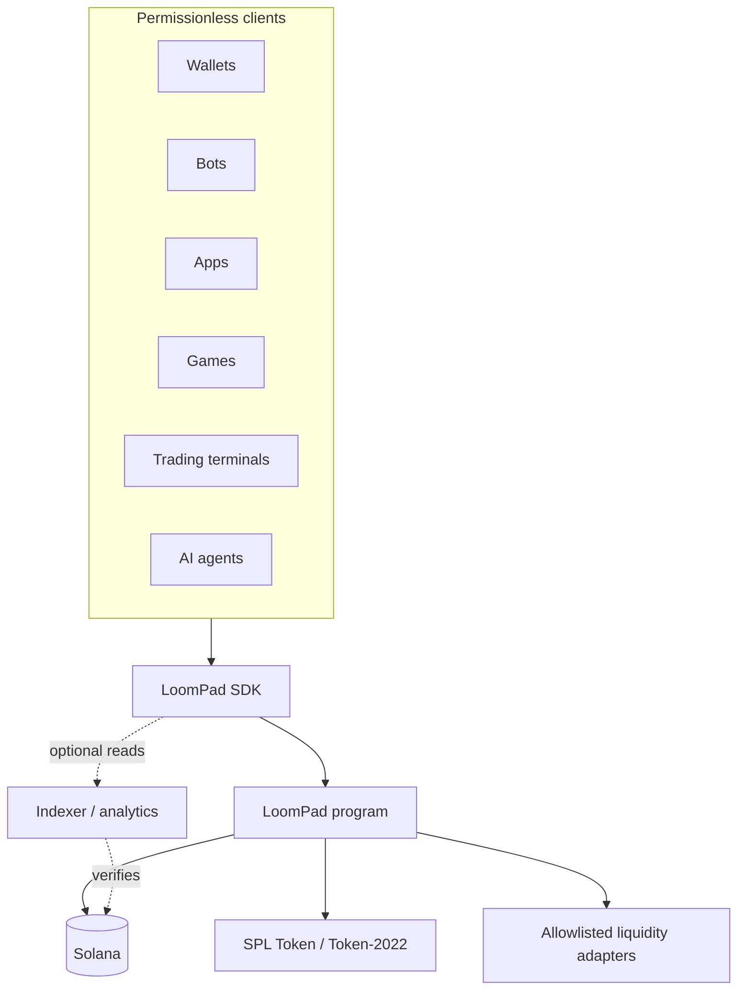
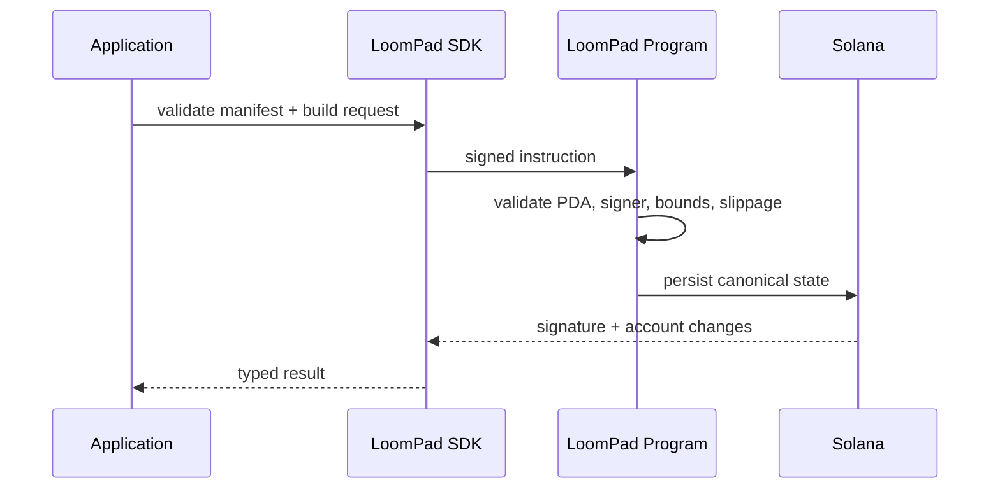

# LoomPad

**A programmable launch layer for Solana.**


LoomPad is an open protocol for describing, creating, and interacting with token launches on Solana. Applications integrate through typed protocol interfaces and an SDK rather than depending on a specific website.

**The frontend is optional. The protocol is the product.**

## Overview

The repository separates four concerns:

- the Anchor program owns canonical configuration and deterministic state;
- `@loompad/protocol` defines the versioned `LaunchManifest`, validation, curve math, vesting, fees, and graduation rules;
- `@loompad/sdk` gives any client the same typed integration surface;
- the optional indexer and reference app improve discovery without becoming transaction intermediaries.

No private keys, privileged relay, or hosted API is required to read a launch. Transaction construction belongs in the SDK and execution belongs on Solana.

## Why LoomPad

A token launched from a bot should have the same inspectable configuration as one launched from a wallet, game, or website. LoomPad makes that configuration portable. A client can determine supply, authorities, fee destinations, creator locks, curve state, and graduation policy from a standard manifest and its corresponding program account.

## Architecture




The API is a cache, never an authority. Clients can reconstruct launch state from program accounts and events.

## LaunchManifest

`LaunchManifest` is the machine-readable contract between the program and its integrations. Version `1.0.0` includes:

- mint, creator, fixed supply, metadata, and timestamps;
- constant-product or linear curve parameters;
- bounded trading fees and exact 10,000-basis-point routing;
- creator allocation and linear vesting with a cliff;
- measurable graduation conditions and a destination adapter;
- explicit authority and configuration-mutability flags;
- optional social data and module identifiers.

The TypeScript validator rejects malformed addresses, insecure metadata URLs, duplicate fee recipients, impossible supply, overflow-sized amounts, missing vesting, invalid curve reserves, and incomplete fee routing. See [the manifest specification](docs/launch-manifest.md).

## Features

- deterministic launch PDAs derived from the mint;
- checked integer arithmetic and integer-only quote calculations;
- explicit minimum-output slippage protection;
- rounding-safe multi-recipient fee allocation;
- transparent creator vesting calculations;
- permissionless graduation after an on-chain threshold;
- transport-agnostic SDK suitable for RPC, wallets, bots, or tests;
- read-only indexer boundary with secure HTTP defaults;
- responsive reference console and integration examples;
- strict TypeScript, lint, format, unit-test, build, audit, and CodeQL checks.


## How it works




Current preview boundary: manifest creation, deterministic validation, quoting, state accounting, vesting math, and graduation checks are implemented. Asset settlement, sell execution, claims, and external liquidity CPI are enabled.

## SDK

```ts
import { LoomPadClient } from "@loompad/sdk";

const client = new LoomPadClient({
  transport: walletTransport,
  defaultSlippageBasisPoints: 100
});

const launch = await client.getLaunch(launchAddress);
const quote = client.estimateBuy(launch, 1_000_000_000n);
console.log(quote.minimumAmountOut, client.getGraduationProgress(launch));
```

The transport interface keeps wallet/RPC selection outside protocol logic. See [SDK integration](docs/sdk.md) and the [examples](examples).

## Repository structure

```text
apps/reference/          optional reference interface
packages/protocol/       manifest types, validation, deterministic math
packages/sdk/            integration-facing client
packages/cli/            manifest developer tools
packages/indexer/        optional read-only indexing boundary
programs/loompad/         Anchor program and canonical accounts
examples/                web, wallet, bot, terminal, and Node patterns
docs/                    architecture, security, and protocol specifications
scripts/                 local repository utilities
```


## Local development

Requirements: Node.js 22+, npm 11+, Rust 1.86, Solana CLI 2.2, and Anchor 0.31.

```bash
cp .env.example .env
npm ci
npm run validate
npm run dev
```

The app is then available at `http://127.0.0.1:5173`. The indexer binds to loopback by default:

```bash
npm run build
npm start -w @loompad/indexer
```

To build the program after installing the pinned toolchain:

```bash
anchor build
anchor test
```

Replace the placeholder development program ID in `declare_id!`, `Anchor.toml`, and the environment before any deployment. Never commit a deploy keypair. Full setup is in [local development](docs/local-development.md).

## Roadmap

- **Phase 1 — protocol core:** manifest, account model, validation, curves, fee routing, vesting, and property tests.
- **Phase 2 — settlement:** SPL Token and SOL custody, buy/sell execution, claims, adversarial validator tests, and external review.
- **Phase 3 — SDK:** wallet adapters, transaction builders, generated IDL types, and stable package releases.
- **Phase 4 — reference clients:** accessible web console and production indexer adapters.
- **Phase 5 — liquidity adapters:** audited adapter interface and first venue integrations.
- **Phase 6 — modules:** documented review process for permissionless extension modules.

Phases are capability gates, not promised dates.

## Contributing

Start with [CONTRIBUTING.md](CONTRIBUTING.md), follow the [Code of Conduct](CODE_OF_CONDUCT.md), and add tests for behavior changes. Protocol changes require a threat-model note and migration analysis.

## License

Licensed under the [Apache License 2.0](LICENSE).