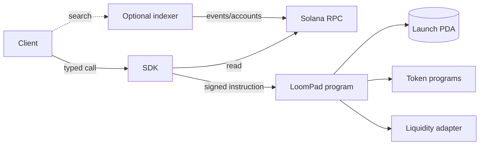

# Architecture

LoomPad uses a protocol-first boundary: canonical facts live in a Solana account, deterministic calculations live in shared libraries, transaction authority lives with the user, and indexed data is a disposable convenience.

## Account model

The launch PDA is derived from the literal seed `launch` and the token mint. The current version stores creator, mint, creation time, immutable metadata pointers, supply, reserves, fees, vesting schedule, graduation threshold, adapter, and status. A version byte makes future decoders explicit.

There is no global registry requirement. Indexers discover accounts by program owner and discriminator. This avoids making a hosted registry a transaction dependency.

## Module boundary

Curve and graduation configurations are tagged unions in the manifest. On-chain implementations should use a closed enum per deployed program version. New code can add variants without allowing an arbitrary unreviewed program to control escrow. External adapters are explicit program IDs fixed at launch creation and require their own review.

## Data flow

1. An application constructs a manifest and validates it locally.
2. A wallet signs a program instruction containing the canonical configuration.
3. The program repeats all security-critical validation and initializes the deterministic PDA.
4. Events let optional indexers materialize query-friendly views.
5. Any client can ignore the indexer and read the account directly.

## Upgrade strategy

There is no production upgrade policy yet. Before deployment, governance must choose between an immutable program and a published, time-delayed upgrade authority. That decision, keys, delay, and emergency limits must be documented on-chain and in this repository. Launch configurations themselves are immutable in account version 1.
