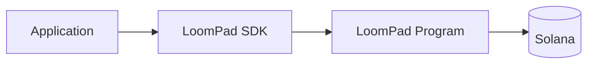

# SDK integration

`@loompad/sdk` is a small orchestration layer around the canonical protocol package. It accepts a transport, so a browser wallet, mobile wallet, backend signer, test double, or bot can integrate without inheriting a hosted service.

Implement `LoomPadTransport` with the signing environment you control. A transport must return decoded program accounts for reads and signatures for submissions. It must never log secret keys, seed phrases, or raw signing material.

The SDK validates manifests before submission, verifies decoded manifests on reads, computes integer-only estimates, and always supplies a minimum output. A quote is informative until the transaction lands; applications should display expiry and re-quote when the blockhash or state changes.
